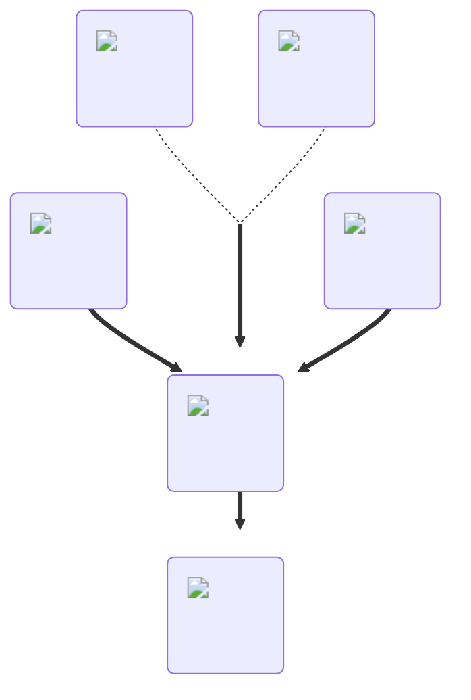

---
hide:
  - toc
description: How to make the blindness potion in yeeps hide and seek
---
<figure markdown="1">
# Blindness
:fontawesome-solid-eye-slash:{ .xxxl }

[Blindness](../brewing/blindness.md) causes the players vision to be limited to a small area around them, while everything else is behind a black fog.

 

[comment]: <> ( This is a hacky fix to get recipe items to scale correctly (theres something janky with image sizes and classes that i cant figure out) )

{ .item-image .hidden .janky-fix }

</figure>