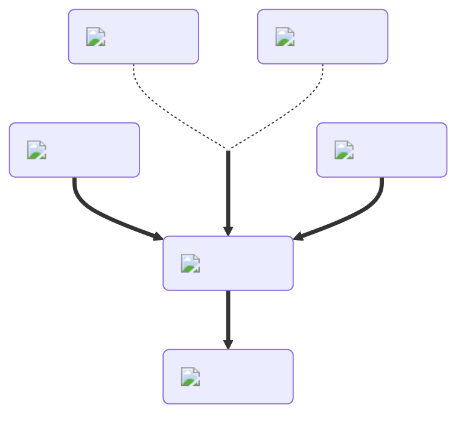

---
hide:
  - toc
---
<figure markdown="1">
# Giant
:fontawesome-solid-person-arrow-up-from-line:{ .xxxl }

The [Giant Potion](../brewing/giant.md), the opposite of the [Tiny Potion](../brewing/tiny.md), causes the player's size to increase. This allows you to pick up and hold large items, such as the [Biggie Sword](), while still large. After the potion's duration ends, you will drop any large items.

 

[comment]: <> ( This is a hacky fix to get recipe items to scale correctly (theres something janky with image sizes and classes that i cant figure out) )

</figure>