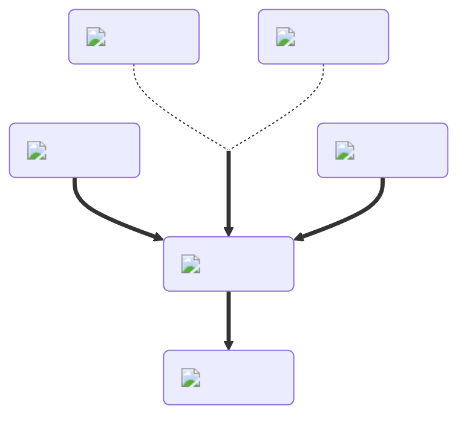

---
hide:
  - toc
description: How to make the spinnign/haste potion in yeeps hide and seek
---
<figure markdown="1">
# Haste
:fontawesome-solid-rotate:{ .xxxl }

The [Haste Potion](../brewing/haste.md), not to be confused with [Speed Potion](../brewing/speed.md), will increase your rotation speed and allow you to spin very fast.

 

[comment]: <> ( This is a hacky fix to get recipe items to scale correctly (theres something janky with image sizes and classes that i cant figure out) )

{ .item-image .hidden .janky-fix }

</figure>