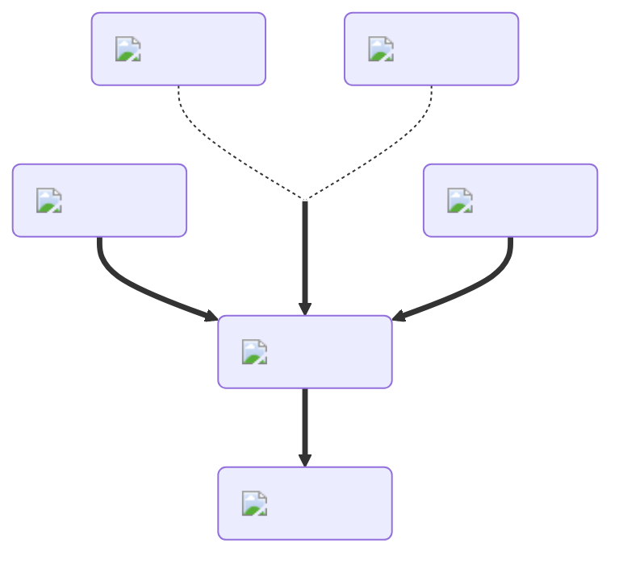

---
hide:
  - toc
description: How to make the healing potion in yeeps hide and seek
---
<figure markdown="1">
# Healing
:fontawesome-solid-heart-circle-plus:{ .xxxl }

The [Healing Potion](../brewing/healing.md), the opposite of the [Poison Potion](../brewing/poison.md), will slowly give you stuffing for its duration.

 

[comment]: <> ( This is a hacky fix to get recipe items to scale correctly (theres something janky with image sizes and classes that i cant figure out) )

{ .item-image .hidden .janky-fix }

</figure>