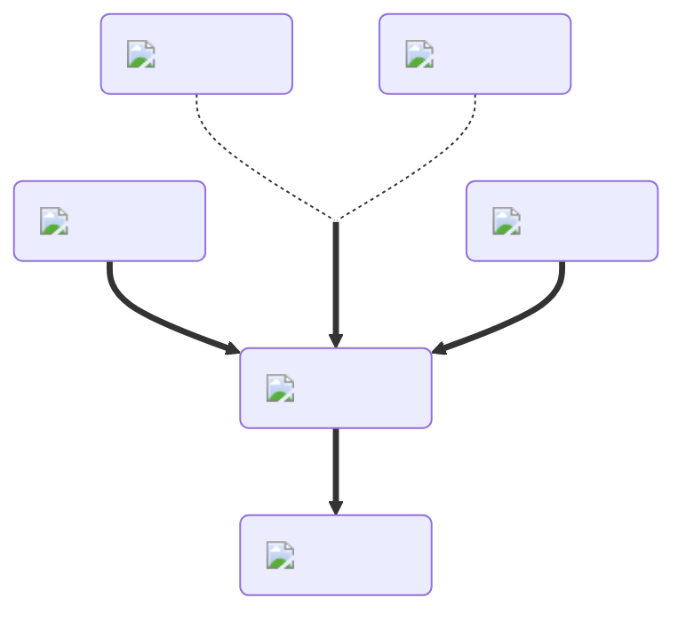

---
hide:
  - toc
---
<figure markdown="1">
# Hollow
:fontawesome-regular-square:{ .xxxl }

The [Hollow Potion](../brewing/hollow.md), similar to the [Invisibility Potion](../brewing/invisibility.md), makes the yeep's normal body disappear, but leaves all cosmetics visible.

 

[comment]: <> ( This is a hacky fix to get recipe items to scale correctly (theres something janky with image sizes and classes that i cant figure out) )

</figure>