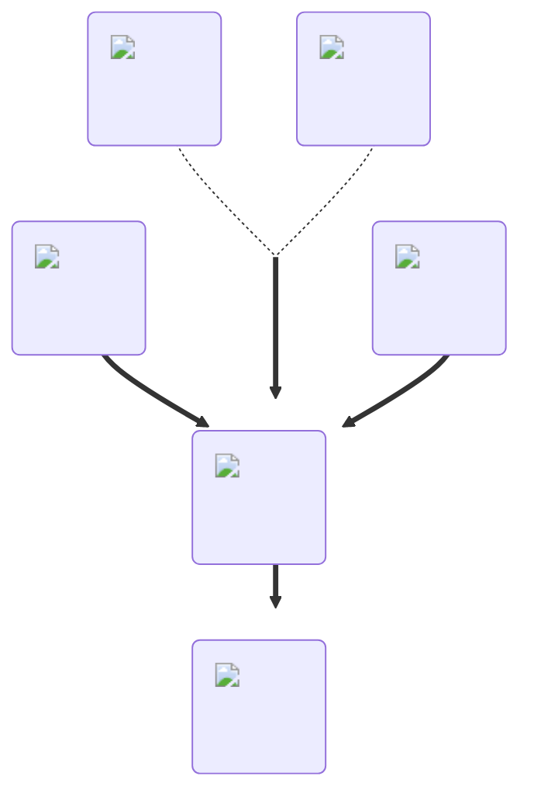

---
hide:
  - toc
description: How to make the invisible potion in yeeps hide and seek
---
<figure markdown="1">
# Invisibility
:fontawesome-solid-ghost:{ .xxxl }

The [Invisibility Potion](../brewing/invisibility.md), similar to the [Hollow Potion](../brewing/hollow.md), makes the yeeps's main body invisible, but also makes all cosmetics disappear.

 

[comment]: <> ( This is a hacky fix to get recipe items to scale correctly (theres something janky with image sizes and classes that i cant figure out) )

{ .item-image .hidden .janky-fix }

</figure>