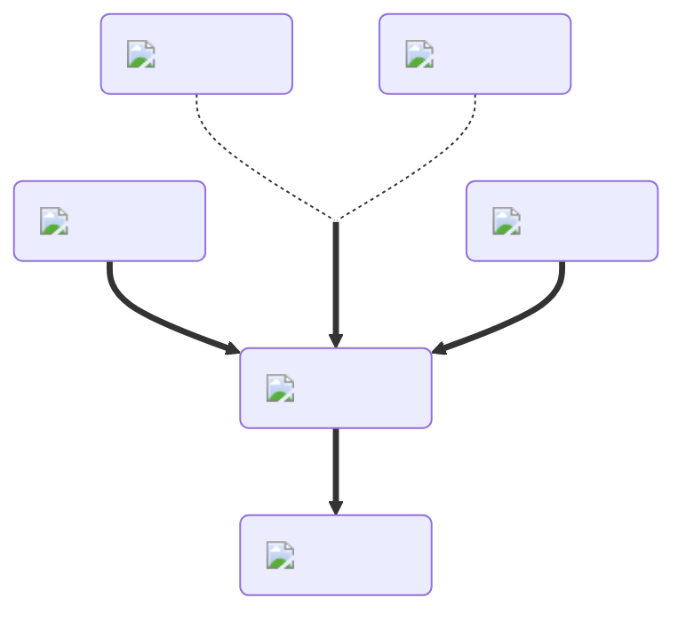

---
hide:
  - toc
---
<figure markdown="1">
# Love
:fontawesome-solid-face-grin-hearts:{ .xxxl }

When two yeeps drink a [Love Potion](../brewing/love.md), both are pulled together. This effect is similar to what a [Rose]() does, but with less strength and it happens over a peroid of time.

 

[comment]: <> ( This is a hacky fix to get recipe items to scale correctly (theres something janky with image sizes and classes that i cant figure out) )

</figure>