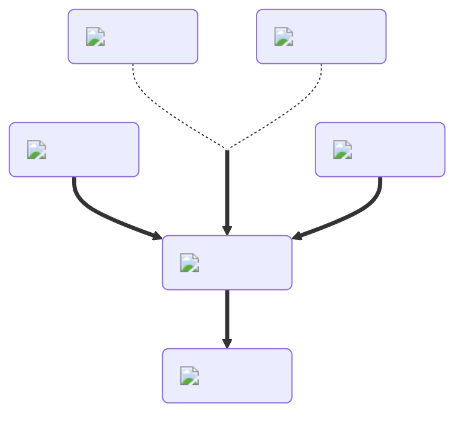

---
hide:
  - toc
---
<figure markdown="1">
# Neutralizer
:fontawesome-solid-kit-medical:{ .xxxl }

The [Neutralizer Potion](../brewing/neutralizer.md) negates the effects of all potions while active. If you drink a potion whose duration has been extended by the [Tall Brewshroom](../brewing/tallBrewshroom.md), then consume a standard [Neutralizer Potion](../brewing/neutralizer.md), the original potion will take effect again once the [Neutralizer Potion](../brewing/neutralizer.md) wears off.

 

[comment]: <> ( This is a hacky fix to get recipe items to scale correctly (theres something janky with image sizes and classes that i cant figure out) )

</figure>