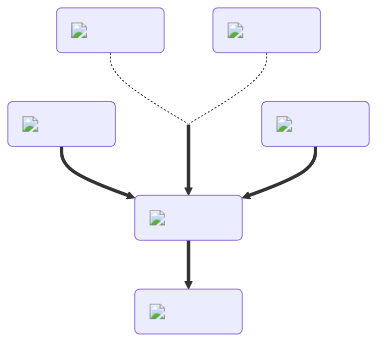

---
hide:
  - toc
description: How to make the night vision potion in yeeps hide and seek
---
<figure markdown="1">
# Night Vision
:fontawesome-solid-eye:{ .xxxl }

The [Night Vision Potion](../brewing/nightVision.md) makes all blocks appear to have full lighting, allowing you to see in otherwise dark areas.

 

[comment]: <> ( This is a hacky fix to get recipe items to scale correctly (theres something janky with image sizes and classes that i cant figure out) )

{ .item-image .hidden .janky-fix }

</figure>