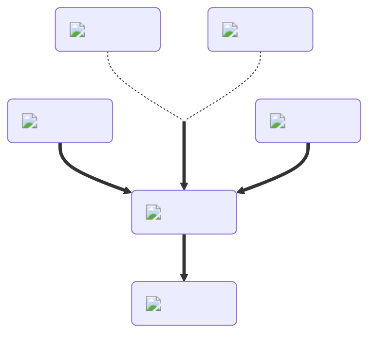

---
hide:
  - toc
description: How to make the poison potion in yeeps hide and seek
---
<figure markdown="1">
# Poison
:fontawesome-solid-biohazard:{ .xxxl }

The [Poison Potion](../brewing/poison.md), the opposite of the [Healing Potion](../brewing/healing.md), will slowly drain your stuffing for the duration of the potion.

 

[comment]: <> ( This is a hacky fix to get recipe items to scale correctly (theres something janky with image sizes and classes that i cant figure out) )

{ .item-image .hidden .janky-fix }

</figure>