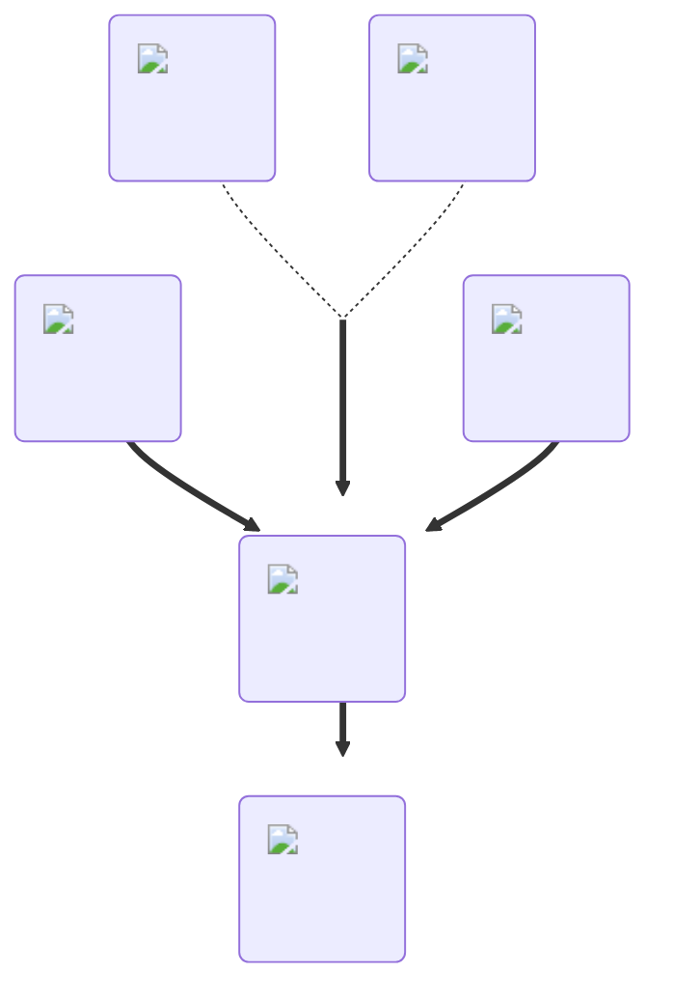

---
hide:
  - toc
description: How to make te slow falling potion in yeeps hide and seek
---
<figure markdown="1">
# Slow Falling
:fontawesome-solid-feather-pointed:{ .xxxl }

The [Slow Falling](../brewing/slowFall.md) will decrease the gravity applied to you, which makes you fall slowly.

 

[comment]: <> ( This is a hacky fix to get recipe items to scale correctly (theres something janky with image sizes and classes that i cant figure out) )

{ .item-image .hidden .janky-fix }

</figure>