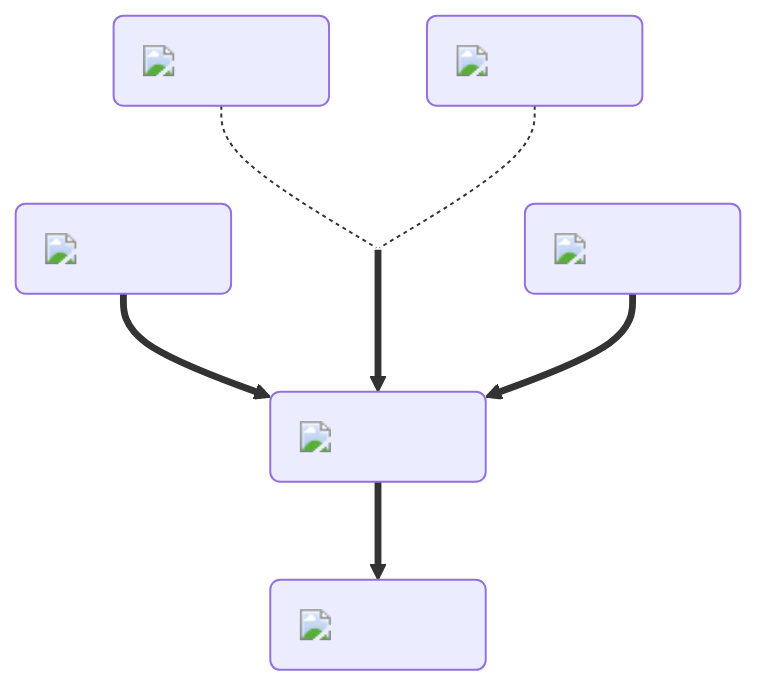

---
hide:
  - toc
---
<figure markdown="1">
# Slowness
:fontawesome-solid-gauge-high:{ .xxxl .flip-horizontal }

The [Slowness Potion](../brewing/slowness.md), the opposite of the [Speed Potion](../brewing/speed.md), decreases your movement speed when pushing off with your hands. Other sources of movement, such as [launchers](), [water](), and so on, are not affected.

 

[comment]: <> ( This is a hacky fix to get recipe items to scale correctly (theres something janky with image sizes and classes that i cant figure out) )

</figure>