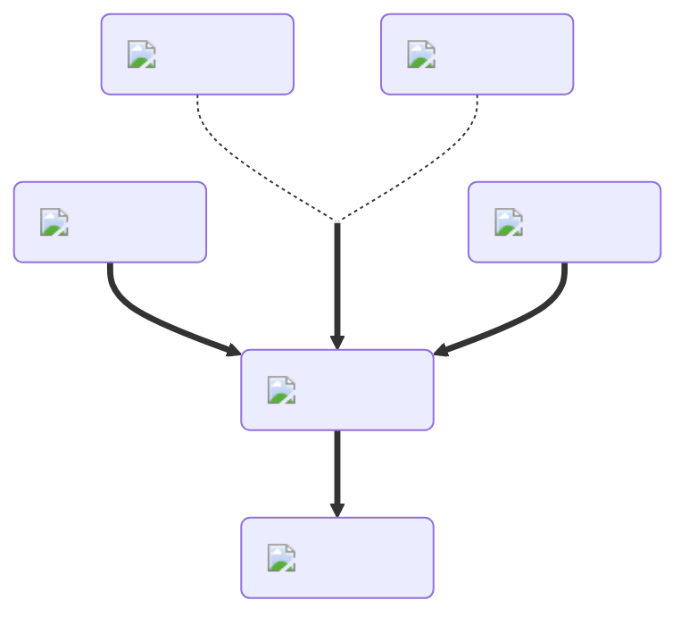

---
hide:
  - toc
description: How to make the speed potion in yeeps hide and seek
---
<figure markdown="1">
# Speed
:fontawesome-solid-gauge-high:{ .xxxl }

The [Speed Potion](../brewing/speed.md), the opposite of the [Slowness Potion](../brewing/slowness.md), increases your movement speed when pushing off with your hands. Other sources of movement, such as [launchers](), [water](), and so on, are not affected.

 

[comment]: <> ( This is a hacky fix to get recipe items to scale correctly (theres something janky with image sizes and classes that i cant figure out) )

{ .item-image .hidden .janky-fix }

</figure>