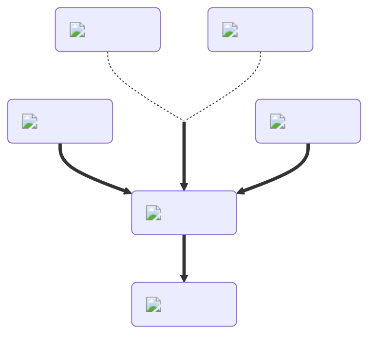

---
hide:
  - toc
description: How to make the strenght/strong potion in yeeps hide and seek
---
<figure markdown="1">
# Strength
:fontawesome-solid-dumbbell:{ .xxxl }

The [Strength Potion](../brewing/strength.md), the opposite of the [Weakness Potion](../brewing/weakness.md), increases the knockback applied to a yeep when you hit them.

 

[comment]: <> ( This is a hacky fix to get recipe items to scale correctly (theres something janky with image sizes and classes that i cant figure out) )

</figure>