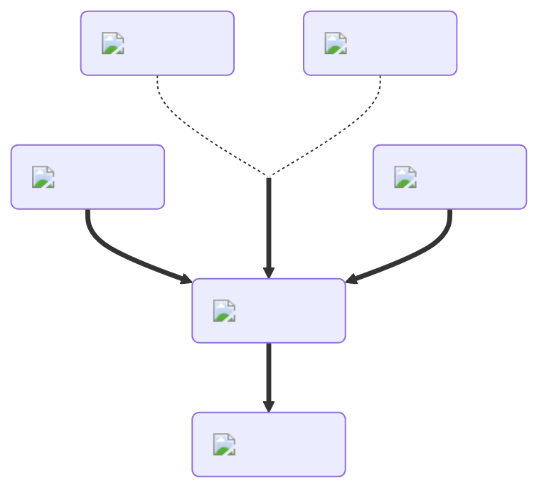

---
hide:
  - toc
description: How to make the tiny/small potion in yeeps hide and seek
---
<figure markdown="1">
# Tiny
:fontawesome-solid-person-arrow-down-to-line:{ .xxxl }

The [Tiny Potion](../brewing/tiny.md), the opposite of the [Giant Potion](../brewing/giant.md), causes the players size to increase. This allows you to fit through gaps you otherwise wouldn't be able to.

 

[comment]: <> ( This is a hacky fix to get recipe items to scale correctly (theres something janky with image sizes and classes that i cant figure out) )

{ .item-image .hidden .janky-fix }

</figure>