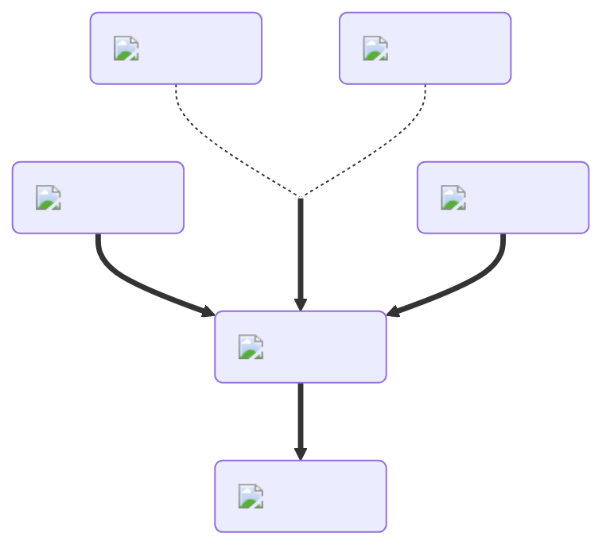

---
hide:
  - toc
---
<figure markdown="1">
# Visibility
:fontawesome-solid-person:{ .xxxl }

The [Visibilty Potion](../brewing/visibility.md) gives you a red outline, allowing you to blend in with seekers.

 

[comment]: <> ( This is a hacky fix to get recipe items to scale correctly (theres something janky with image sizes and classes that i cant figure out) )

</figure>