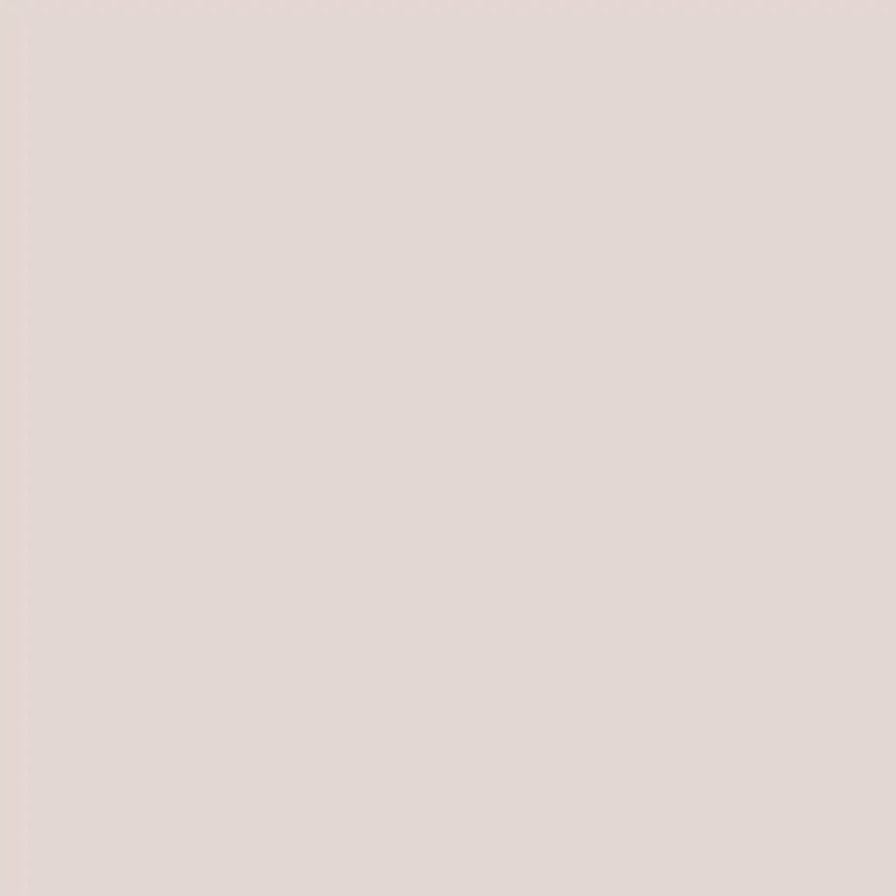
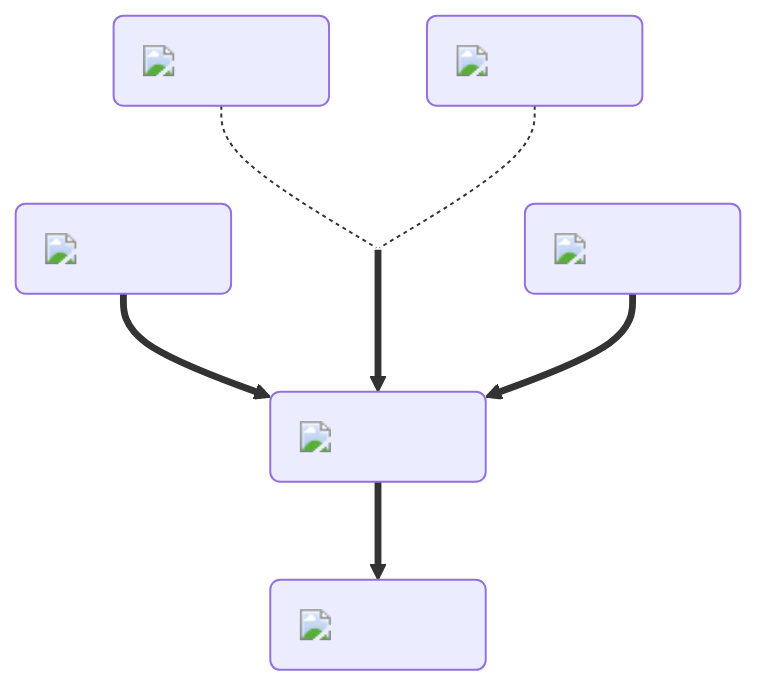

---
hide:
  - toc
description: How to make the weakness potion in yeeps hide and seek
---
<figure markdown="1">
# Weakness
:fontawesome-solid-person-cane:{ .xxxl }

The [Weakness Potion](../brewing/weakness.md), the opposite of the [Strength Potion](../brewing/strength.md), decreases the knockback applied a yeep when you hit them.

 

[comment]: <> ( This is a hacky fix to get recipe items to scale correctly (theres something janky with image sizes and classes that i cant figure out) )

</figure>