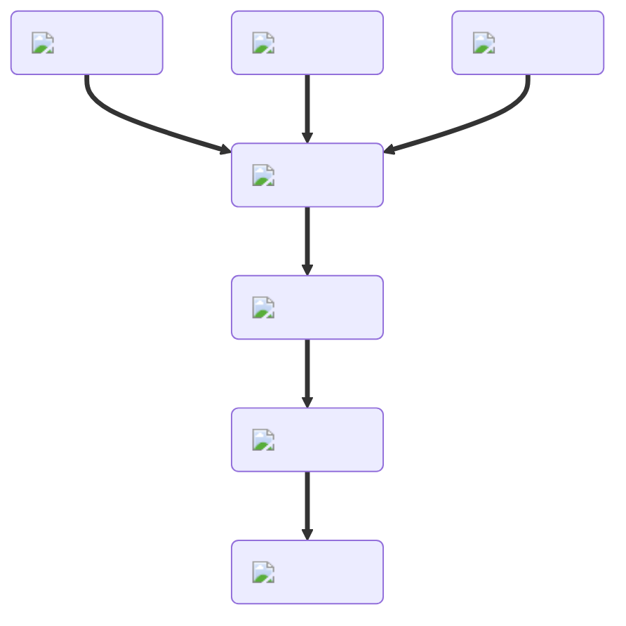

---
hide:
  - toc
description: How to make a bagel in yeeps hide and seek
---
<figure markdown="1">
# Bagel
{ .item-image }

## Used to craft

- [Donut { width="100" }](../cooking/donut.md)
- [Pizza Bagel { width="100"}](../cooking/pizzaBagel.md)

</figure>
