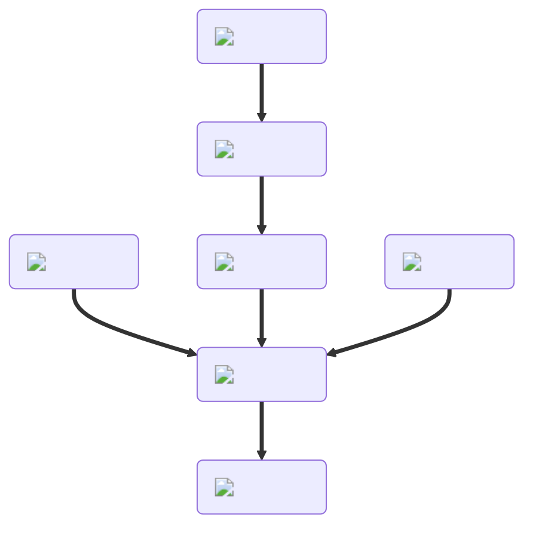

---
hide:
  - toc
---
<figure markdown="1">
# Baked Potato
{ .item-image }

```mermaid
graph TD
    POTATO(<img src="../../assets/images/cooking/potato.webp" width="50"/>)
    BACON(<img src="../../assets/images/cooking/bacon.webp" width="50"/>)
    MILK(<img src="../../assets/images/cooking/milk.webp" width="50"/>)
    POT(<img src="../../assets/images/cooking/pot.webp" width ="50">)
    CHEESE(<img src="../../assets/images/cooking/cheese.webp" width="50"/>)
    OVEN(<img src="../../assets/images/cooking/oven.webp" width="50"/>)
    BAKEDPOTATO(<img src="../../assets/images/cooking/bakedPotato.webp" width="50"/>)
    
    MILK ==> POT
    POT ==> CHEESE
    POTATO ==> OVEN
    CHEESE ==> OVEN
    BACON ==> OVEN
    OVEN ==> BAKEDPOTATO


    click POTATO "../potato"
    click BACON "../bacon"
    click MILK "../milk"
    click POT "../pot"
    click CHEESE "../cheese"
    click OVEN "../oven"
    click BAKEDPOTATO "../bakedPotato"

```

</figure>
