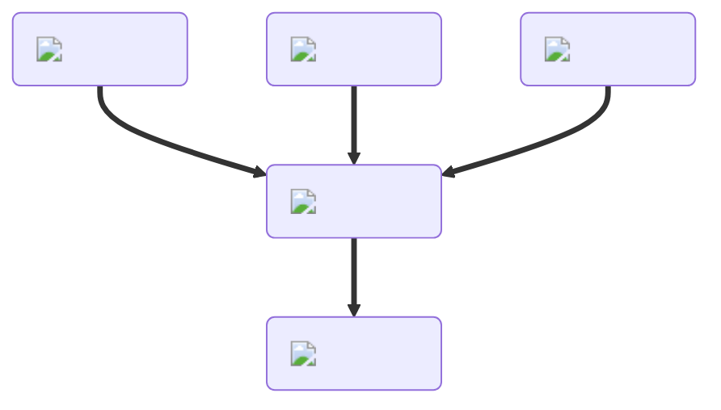

---
hide:
  - toc
description: How to make batter in yeeps hide and seek
---
<figure markdown="1">
# Batter
{ .item-image }

## Used to craft

- [Bagel { width="100" }](../cooking/bagel.md)  
- [Cake { width="100" }](../cooking/cake.md)  
- [Chicken Tender { width="100" }](../cooking/chickenTender.md)  
- [Cookie { width="100" }](../cooking/cookie.md)  
- [Crepe { width="100" }](../cooking/crepe.md)  
- [Donut { width="100" }](../cooking/donut.md)  
- [Pizza Bagel { width="100" }](../cooking/pizzaBagel.md)  

</figure>