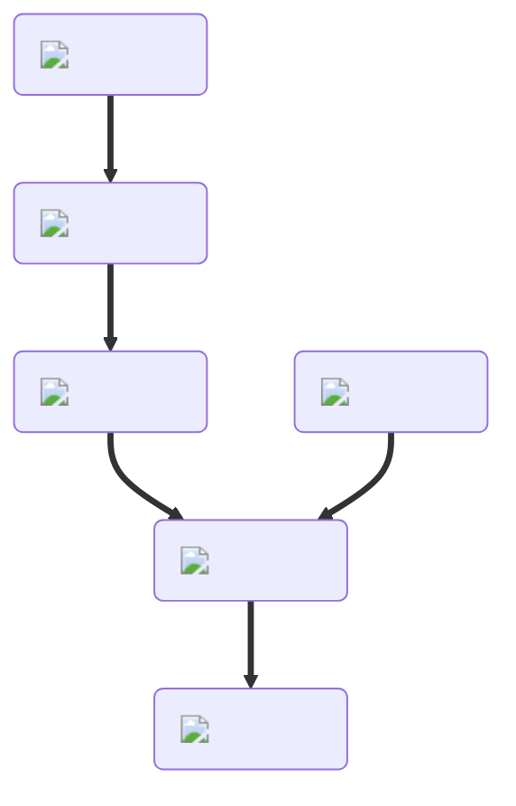

---
hide:
  - toc
---
<figure markdown="1">
# Beef Stew
{ .item-image }

```mermaid
graph TD
    POT1(<img src="../../assets/images/cooking/pot.webp" width="50"/>)
    BEEF(<img src="../../assets/images/cooking/beef.webp" width="50"/>)
    POTATO(<img src="../../assets/images/cooking/potato.webp" width="50"/>)
    STEAK(<img src="../../assets/images/cooking/steak.webp" width="50"/>)
    POT2(<img src="../../assets/images/cooking/pot.webp" width="50"/>)
    BEEFSTEW(<img src="../../assets/images/cooking/beefStew.webp" width="50"/>)

    BEEF ==> POT1
    POT1 ==> STEAK
    STEAK ==> POT2
    POTATO ==> POT2
    POT2 ==> BEEFSTEW

    click BEEF "../beef"
    click POT1 "../pot"
    click POTATO "../potato"
    click STEAK "../steak"
    click POT2 "../pot"
    click BEEFSTEW "../beefStew"
```
</figure>