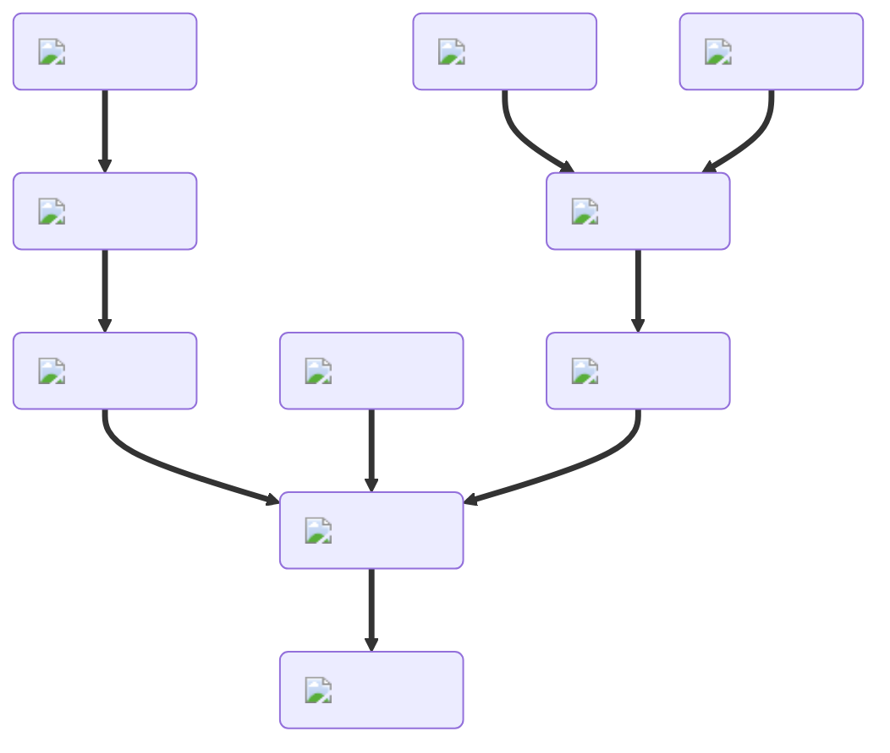

---
hide:
  - toc
---
<figure markdown="1">
# BLT
{ .item-image }

```mermaid
graph TD
    OVEN(<img src="../../assets/images/cooking/oven.webp" width="50"/>)
    FLOUR(<img src="../../assets/images/cooking/flour.webp" width="50"/>)
    BREAD(<img src="../../assets/images/cooking/bread.webp" width="50"/>)
    BACON(<img src="../../assets/images/cooking/bacon.webp" width="50"/>)
    SALAD(<img src="../../assets/images/cooking/salad.webp" width="50"/>)
    POT(<img src="../../assets/images/cooking/pot.webp" width="50"/>)
    BLT(<img src="../../assets/images/cooking/blt.webp" width="50"/>)
    TOMATO(<img src="../../assets/images/cooking/tomato.webp" width="50"/>)
    LETTUCE(<img src="../../assets/images/cooking/lettuce.webp" width="50"/>)
    POT2(<img src="../../assets/images/cooking/pot.webp" width="50"/>)
    
    FLOUR ==> OVEN
    OVEN ==> BREAD
    BREAD ==> POT
    BACON ==> POT
    SALAD ==> POT
    POT ==> BLT
    TOMATO ==> POT2
    LETTUCE ==> POT2
    POT2 ==> SALAD

    click OVEN "../oven"
    click FLOUR "../flour"
    click BREAD "../bread"
    click BACON "../bacon"
    click SALAD "../salad"
    click POT "../pot"
    click BLT "../blt"
    click TOMATO "../tomato"
    click LETTUCE "../lettuce"
    click POT2 "../pot"

```
</figure>