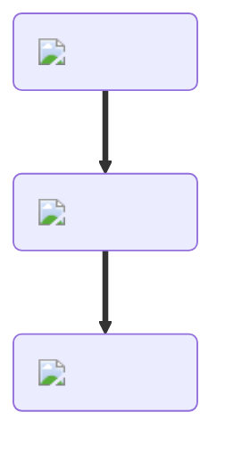

---
hide:
  - toc
---
<figure markdown="1">
# Bread
{ .item-image }

## Used to craft  

- [BLT { width="100" }](blt.md)  
- [Cheeseburger { width="100" }](../cooking/cheeseburger.md)  
- [Cheese Sandwich { width="100" }](../cooking/cheeseSandwich.md)  
- [French Toast { width="100" }](../cooking/frenchToast.md)  
- [Fried Chicken Sandwich { width="100" }](../cooking/friedChickenSandwich.md)  
- [Fried Egg Sandwich { width="100" }](../cooking/friedEggSandwich.md)  
- [Hamburger { width="100" }](../cooking/hamburger.md)  
- [Hotdog { width="100" }](../cooking/hotdog.md)  
- [Jelly Sandwich { width="100" }](../cooking/jellySandwich.md)  
- [Steak Sub { width="100" }](../cooking/steakSub.md)  

</figure>