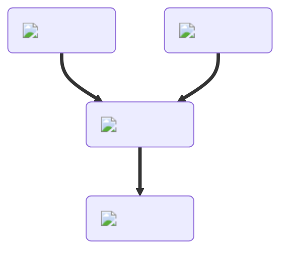

---
hide:
  - toc
description: How to make a breakfast/eggs and bacon in yeeps hide and seek
---
<figure markdown="1">
# Breakfast
{ .item-image }

```mermaid
graph TD

    EGG(<img src="../../assets/images/cooking/egg.webp" width="50"/>)
    BACON(<img src="../../assets/images/cooking/bacon.webp" width="50"/>)
    POT(<img src="../../assets/images/cooking/pot.webp" width="50"/>)
    BREAKFAST(<img src="../../assets/images/cooking/breakfast.webp" width="50"/>)

    EGG ==> POT
    BACON ==> POT
    POT ==> BREAKFAST

    click EGG "../egg"
    click BACON "../bacon"
    click POT "../pot"
    click BREAKFAST "../breakfast"

```
</figure>