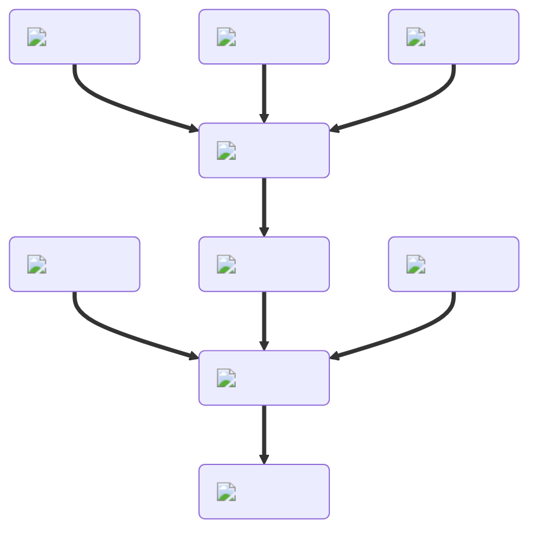

---
hide:
  - toc
description: How to make cake in yeeps hide and seek
---
<figure markdown="1">
# Cake
{ .item-image }

```mermaid
graph TD

    FLOUR(<img src="../../assets/images/cooking/flour.webp" width="50"/>)
    EGGS(<img src="../../assets/images/cooking/egg.webp" width="50"/>)
    MILK(<img src="../../assets/images/cooking/milk.webp" width="50"/>)
    POT(<img src="../../assets/images/cooking/pot.webp" width="50"/>)
    BATTER(<img src="../../assets/images/cooking/batter.webp" width="50"/>)
    FRUIT(<img src="../../assets/images/cooking/fruit.webp" width="50"/>)
    SUGAR(<img src="../../assets/images/cooking/sugar.webp" width="50"/>)
    OVEN(<img src="../../assets/images/cooking/oven.webp" width="50"/>)
    CAKE(<img src="../../assets/images/cooking/cake.webp" width="50"/>)

    FLOUR ==> POT
    EGGS ==> POT
    MILK ==> POT
    POT ==> BATTER
    FRUIT ==> OVEN
    BATTER ==> OVEN
    SUGAR ==> OVEN
    OVEN ==> CAKE

    click FLOUR "../flour"
    click EGGS "../egg"
    click MILK "../milk"
    click POT "../pot"
    click BATTER "../batter"
    click FRUIT "../fruit"
    click SUGAR "../sugar"
    click OVEN "../oven"
    click CAKE "../cake"

```

</figure>