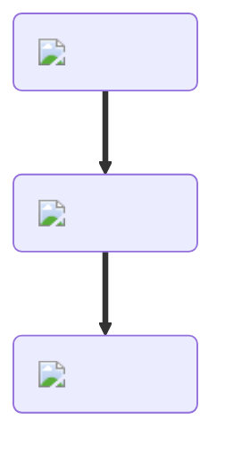

---
hide:
  - toc
---
<figure markdown="1">
# Cheese
{ .item-image }

## Used to craft  

- [Baked Potato { width="100" }](../cooking/bakedPotato.md)  
- [Cheeseburger { width="100" }](../cooking/cheeseburger.md)  
- [Cheese Sandwich { width="100" }](../cooking/cheeseSandwich.md)  
- [Chicken Parm { width="100" }](../cooking/chickenParm.md)  
- [Grilled Cheese Sandwich { width="100" }](../cooking/grilledCheeseSandwich.md)  
- [Hawaiian Pizza { width="100" }](../cooking/hawaiianPizza.md)  
- [Lasagna { width="100" }](../cooking/lasagna.md)  
- [Mac and Cheese { width="100" }](../cooking/macAndCheese.md)  
- [Pepperoni Pizza { width="100" }](../cooking/pepperoniPizza.md)  
- [Pizza { width="100" }](../cooking/pizza.md)  
- [Pizza Bagel { width="100" }](../cooking/pizzaBagel.md)  
- [Quesadilla { width="100" }](../cooking/quesadilla.md)  
- [Steak Sub { width="100" }](../cooking/steakSub.md)  
- [Taco Beef { width="100" }](../cooking/tacoBeef.md)  
- [Taco Chicken { width="100" }](../cooking/tacoChicken.md)  

</figure>