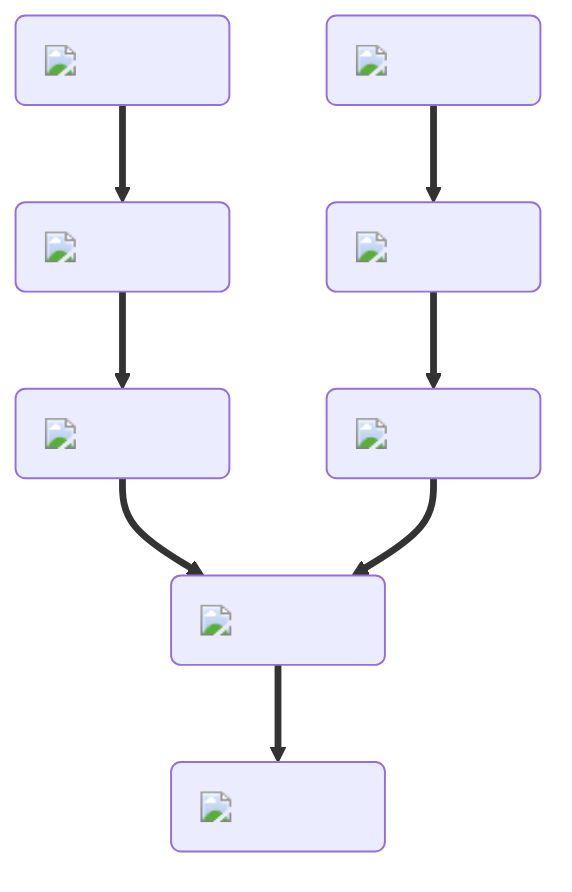

---
hide:
  - toc
---
<figure markdown="1">
# Cheese Sandwich
{ .item-image }

```mermaid
graph TD
    MILK(<img src="../../assets/images/cooking/milk.webp" width="50"/>)
    POT1(<img src="../../assets/images/cooking/pot.webp" width="50"/>)
    CHEESE(<img src="../../assets/images/cooking/cheese.webp" width="50"/>)
    FLOUR(<img src="../../assets/images/cooking/flour.webp" width="50"/>)
    OVEN(<img src="../../assets/images/cooking/oven.webp" width="50"/>)
    BREAD(<img src="../../assets/images/cooking/bread.webp" width="50"/>)
    POT2(<img src="../../assets/images/cooking/pot.webp" width="50"/>)
    CHEESESANDWICH(<img src="../../assets/images/cooking/cheeseSandwich.webp" width="50"/>)

    MILK ==> POT1
    POT1 ==> CHEESE
    FLOUR ==> OVEN
    OVEN ==> BREAD
    BREAD ==> POT2
    CHEESE ==> POT2
    POT2 ==> CHEESESANDWICH

    click MILK "../milk"
    click POT1 "../pot"
    click CHEESE "../cheese"
    click FLOUR "../flour"
    click OVEN "../oven"
    click BREAD "../bread"
    click POT2 "../pot"
    click CHEESESANDWICH "../cheeseSandwich"
```

</figure>