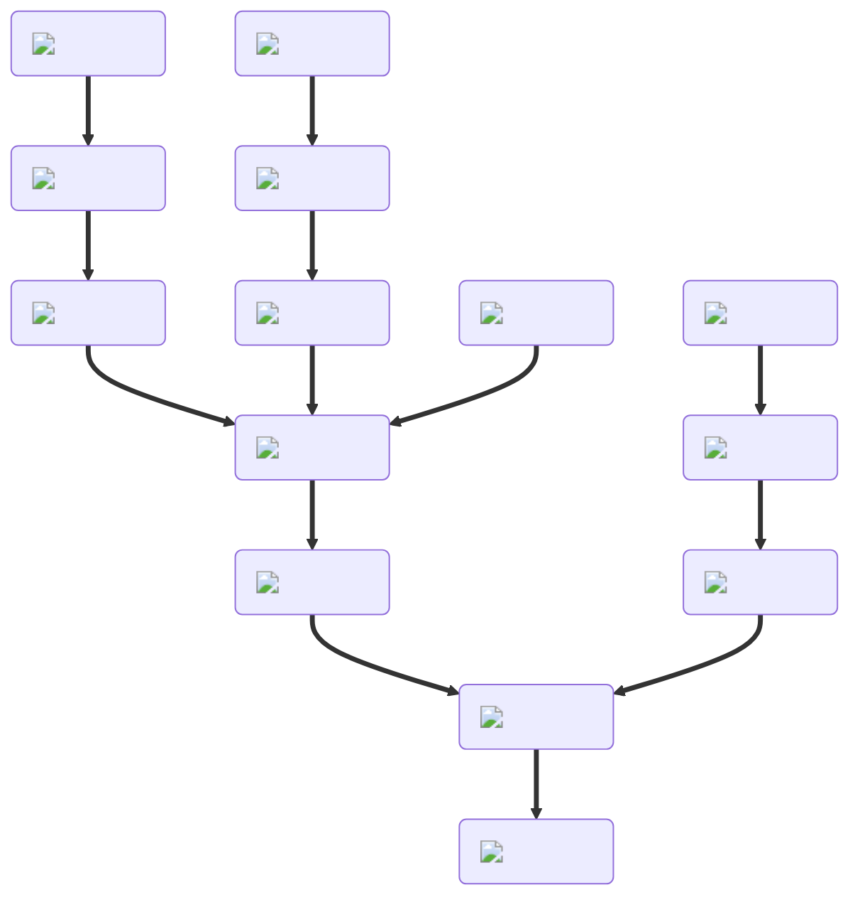

---
hide:
  - toc
description: How to make a cheeeseburger in yeeps hide and seek
---
<figure markdown="1">
# Cheeseburger
{ .item-image }

```mermaid
graph TD
    FLOUR(<img src="../../assets/images/cooking/flour.webp" width="50"/>)
    OVEN(<img src="../../assets/images/cooking/oven.webp" width="50"/>)
    BREAD(<img src="../../assets/images/cooking/bread.webp" width="50"/>)
    MILK(<img src="../../assets/images/cooking/milk.webp" width="50"/>)
    POT1(<img src="../../assets/images/cooking/pot.webp" width="50"/>)
    CHEESE(<img src="../../assets/images/cooking/cheese.webp" width="50"/>)
    BEEF(<img src="../../assets/images/cooking/beef.webp" width="50"/>)
    POT2(<img src="../../assets/images/cooking/pot.webp" width="50"/>)
    STEAK(<img src="../../assets/images/cooking/steak.webp" width="50"/>)
    LETTUCE(<img src="../../assets/images/cooking/lettuce.webp" width="50"/>)
    POT3(<img src="../../assets/images/cooking/pot.webp" width="50"/>)
    BURGER(<img src="../../assets/images/cooking/hamburger.webp" width="50"/>)
    POT4(<img src="../../assets/images/cooking/pot.webp" width="50"/>)
    CHEESEBURGER(<img src="../../assets/images/cooking/cheeseburger.webp" width="50"/>)

    FLOUR ==> OVEN
    OVEN ==> BREAD
    MILK ==> POT1
    POT1 ==> CHEESE
    BEEF ==> POT2
    POT2 ==> STEAK
    BREAD ==> POT3
    STEAK ==> POT3
    LETTUCE ==> POT3
    POT3 ==> BURGER
    BURGER ==> POT4
    CHEESE ==> POT4
    POT4 ==> CHEESEBURGER

    click FLOUR "../flour"
    click OVEN "../oven"
    click MILK "../milk"
    click POT1 "../pot"
    click BEEF "../beef"
    click POT2 "../pot"
    click BREAD "../bread"
    click STEAK "../steak"
    click LETTUCE "../lettuce"
    click POT3 "../pot"
    click BURGER "../hamburger"
    click CHEESE "../cheese"
    click POT4 "../pot"
    click CHEESEBURGER "../cheeseburger"

```

</figure>