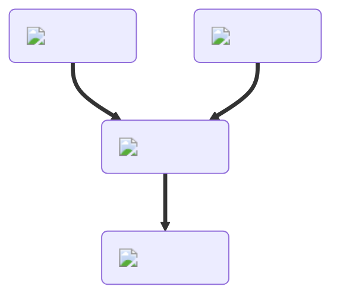

---
hide:
  - toc
description: How to make chicken noodle soup in yeeps hide and seek
---
<figure markdown="1">
# Chicken Noodle Soup
{ .item-image }

```mermaid
graph TD
    NOODLES(<img src="../../assets/images/cooking/noodles.webp" width="50"/>)
    CHICKEN(<img src="../../assets/images/cooking/chicken.webp" width="50"/>)
    POT(<img src="../../assets/images/cooking/pot.webp" width="50"/>)
    SOUP(<img src="../../assets/images/cooking/chickenNoodleSoup.webp" width="50"/>)

    NOODLES ==> POT
    CHICKEN ==> POT
    POT ==> SOUP

    click NOODLES "../noodles"
    click CHICKEN "../chicken"
    click POT "../pot"
    click SOUP "../chickenNoodleSoup"
```

</figure>