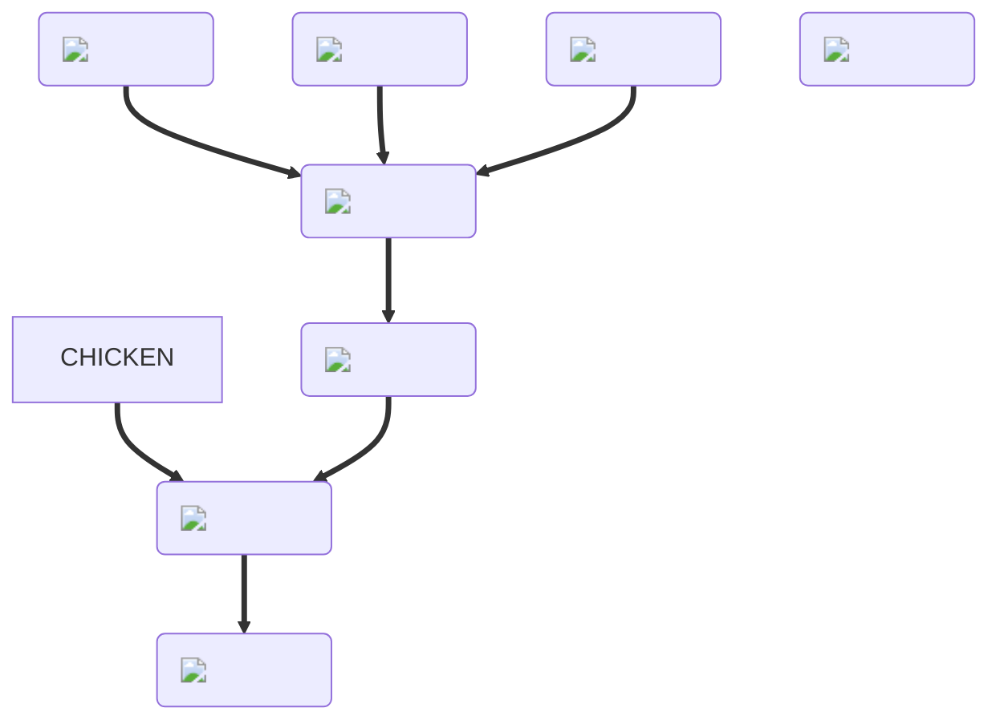

---
hide:
  - toc
---
<figure markdown="1">
# Chicken Tender
{ .item-image }

```mermaid
graph TD
    FLOUR(<img src="../../assets/images/cooking/flour.webp" width="50"/>)
    EGGS(<img src="../../assets/images/cooking/egg.webp" width="50"/>)
    MILK(<img src="../../assets/images/cooking/milk.webp" width="50"/>)
    POT1(<img src="../../assets/images/cooking/pot.webp" width="50"/>)
    BATTER(<img src="../../assets/images/cooking/batter.webp" width="50"/>)
    CHIKEN(<img src="../../assets/images/cooking/chicken.webp" width="50"/>)
    POT2(<img src="../../assets/images/cooking/pot.webp" width="50"/>)
    CHICKENTENDER(<img src="../../assets/images/cooking/chickenTender.webp" width="50"/>)

    FLOUR ==> POT1
    EGGS ==> POT1
    MILK ==> POT1
    POT1 ==> BATTER
    CHICKEN ==> POT2
    BATTER ==> POT2
    POT2 ==> CHICKENTENDER

    click FLOUR "../flour"
    click EGGS "../egg"
    click MILK "../milk"
    click POT1 "../pot"
    click BATTER "../batter"
    click CHICKEN "../chicken"
    click POT2 "../pot"
    click CHICKENTENDER "../chickenTender"
```

</figure>