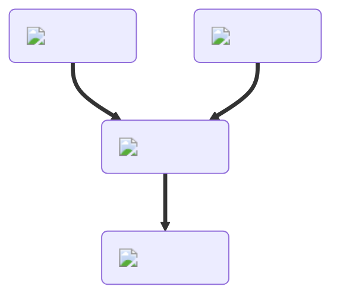

---
hide:
  - toc
---
<figure markdown="1">
# Dumpling
{ .item-image }

```mermaid
graph TD
    FLOUR(<img src="../../assets/images/cooking/flour.webp" width="50"/>)
    LETTUCE(<img src="../../assets/images/cooking/lettuce.webp" width="50"/>)
    POT(<img src="../../assets/images/cooking/pot.webp" width="50"/>)
    DUMPLING(<img src="../../assets/images/cooking/dumpling.webp" width="50"/>)

    FLOUR ==> POT
    LETTUCE ==> POT
    POT ==> DUMPLING

    click FLOUR "../flour"
    click LETTUCE "../lettuce"
    click POT "../pot"
    click DUMPLING "../dumpling"
```

</figure>