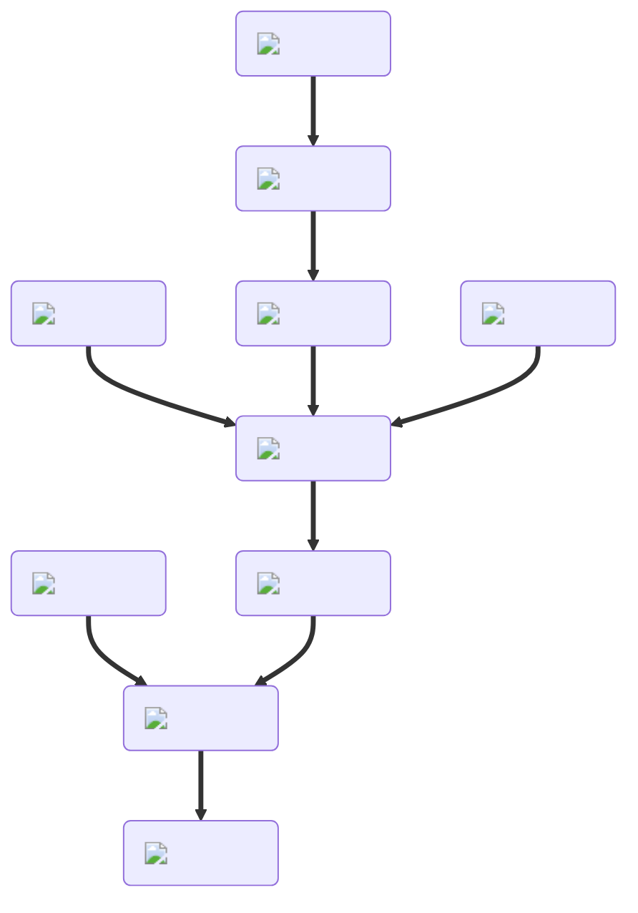

---
hide:
  - toc
description: How to make fancy mac and cheese in yeeps hide and seek
---
<figure markdown="1">
# Fancy Mac & Cheese
{ .item-image }

```mermaid
graph TD
    MILK1(<img src="../../assets/images/cooking/milk.webp" width="50"/>)
    POT1(<img src="../../assets/images/cooking/pot.webp" width="50"/>)
    CHEESE(<img src="../../assets/images/cooking/cheese.webp" width="50"/>)
    MILK2(<img src="../../assets/images/cooking/milk.webp" width="50"/>)
    NOODLES(<img src="../../assets/images/cooking/noodles.webp" width="50"/>)
    POT2(<img src="../../assets/images/cooking/pot.webp" width="50"/>)
    MACANDCHEESE(<img src="../../assets/images/cooking/macAndCheese.webp" width="50"/>)
    BACON(<img src="../../assets/images/cooking/bacon.webp" width="50"/>)
    OVEN(<img src="../../assets/images/cooking/oven.webp" wdith="50"/>)
    FANCYMACANDCHEESE(<img src="../../assets/images/cooking/fancyMacAndCheese.webp" width="50"/>)

    MILK1 ==> POT1
    POT1 ==> CHEESE
    MILK2 ==> POT2
    CHEESE ==> POT2
    NOODLES ==> POT2
    POT2 ==> MACANDCHEESE 
    BACON ==> OVEN
    MACANDCHEESE ==> OVEN
    OVEN ==> FANCYMACANDCHEESE

    click MILK1 "../milk"
    click POT1 "../pot"
    click CHEESE "../cheese"
    click MILK2 "../milk"
    click NOODLES "../noodles"
    click POT2 "../pot"
    click MACANDCHEESE "../macAndCheese"
    click BACON "../bacon"
    click OVEN "../oven"
    click FANCYMACANDCHEESE "../fancyMacAndCheese"
```

</figure>