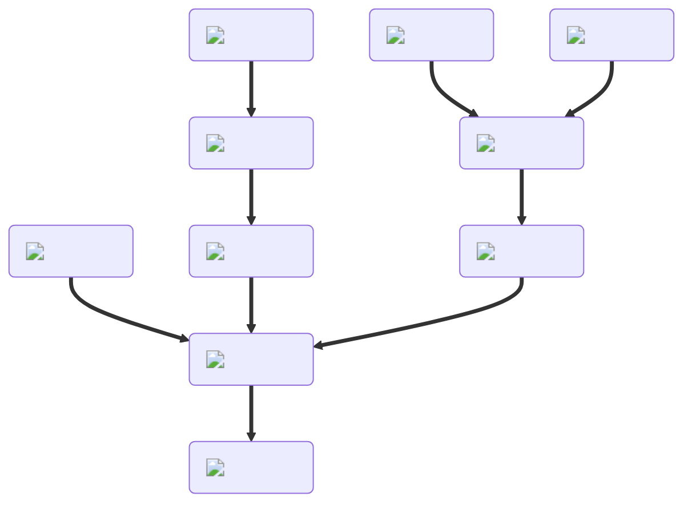

---
hide:
  - toc
---
<figure markdown="1">
# French Toast
{ .item-image }

```mermaid
graph TD
    SUGAR1(<img src="../../assets/images/cooking/sugar.webp" width="50"/>)
    SUGAR2(<img src="../../assets/images/cooking/sugar.webp" width="50"/>)
    POT1(<img src="../../assets/images/cooking/pot.webp" width="50"/>)
    SYRUP(<img src="../../assets/images/cooking/syrup.webp" width="50"/>)
    FLOUR(<img src="../../assets/images/cooking/flour.webp" width="50"/>)
    OVEN(<img src="../../assets/images/cooking/oven.webp" width="50"/>)
    BREAD(<img src="../../assets/images/cooking/bread.webp" width="50"/>)
    EGGS(<img src="../../assets/images/cooking/egg.webp" width="50"/>)
    POT2(<img src="../../assets/images/cooking/pot.webp" width="50"/>)
    FRENCHTOAST(<img src="../../assets/images/cooking/frenchToast.webp" width="50"/>)

    SUGAR1 ==> POT1
    SUGAR2 ==> POT1
    POT1 ==> SYRUP
    FLOUR ==> OVEN
    OVEN ==> BREAD
    EGGS ==> POT2
    BREAD ==> POT2
    SYRUP ==> POT2
    POT2 ==> FRENCHTOAST

    click SUGAR1 "../sugar"
    click SUGAR2 "../sugar"
    click POT1 "../pot"
    click SYRUP "../syrup"
    click FLOUR "../flour"
    click OVEN "../oven"
    click BREAD "../bread"
    click EGGS "../egg"
    click POT2 "../pot"
    click FRENCHTOAST "../frenchToast"
```

</figure>