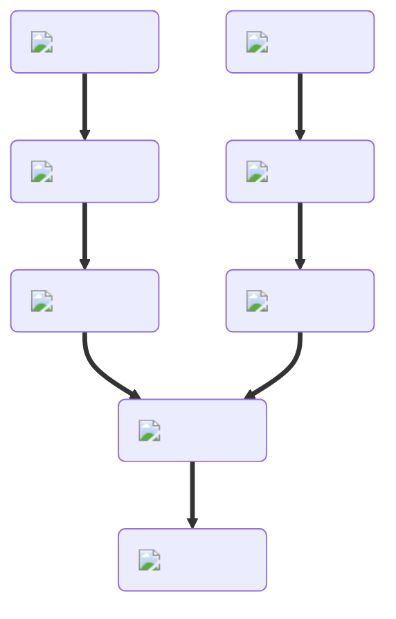

---
hide:
  - toc
---
<figure markdown="1">
# Fried Chicken Sandwich
{ .item-image }

```mermaid
graph TD
    CHICKEN(<img src="../../assets/images/cooking/chicken.webp" width="50"/>)
    POT1(<img src="../../assets/images/cooking/pot.webp" width="50"/>)
    FRIEDCHICKEN(<img src="../../assets/images/cooking/friedChicken.webp" width="50"/>)
    FLOUR(<img src="../../assets/images/cooking/flour.webp" width="50"/>)
    OVEN(<img src="../../assets/images/cooking/oven.webp" width="50"/>)
    BREAD(<img src="../../assets/images/cooking/bread.webp" width="50"/>)
    POT2(<img src="../../assets/images/cooking/pot.webp" width="50"/>)
    FRIEDCHICKENSANDWICH(<img src="../../assets/images/cooking/friedChickenSandwich.webp" width="50"/>)

    CHICKEN ==> POT1
    POT1 ==> FRIEDCHICKEN
    FLOUR ==> OVEN
    OVEN ==> BREAD
    FRIEDCHICKEN ==> POT2
    BREAD ==> POT2
    POT2 ==> FRIEDCHICKENSANDWICH
    

    click CHICKEN "../chicken"
    click POT "../pot"
    click FRIEDCHICKEN "../friedChicken"
    click FLOUR "../flour"
    click OVEN "../oven"
    click BREAD "../bread"
    click POT2 "../pot"
    click FRIENDCHICKENSANDWICH "../firedChickenSandwich"
```

</figure>