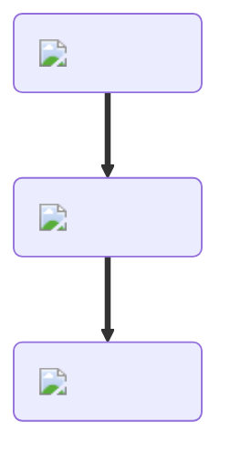

---
hide:
  - toc
---
<figure markdown="1">
# Fried Egg
{ .item-image }

```mermaid
graph TD
    EGG(<img src="../../assets/images/cooking/egg.webp" width="50"/>)
    POT(<img src="../../assets/images/cooking/pot.webp" width="50"/>)
    FRIEDEGG(<img src="../../assets/images/cooking/friedEgg.webp" width="50"/>)

    EGG ==> POT
    POT ==> FRIEDEGG

    click EGG "../egg"
    click POT "../pot"
    click FRIEDEGG "../friedEgg"
```

</figure>