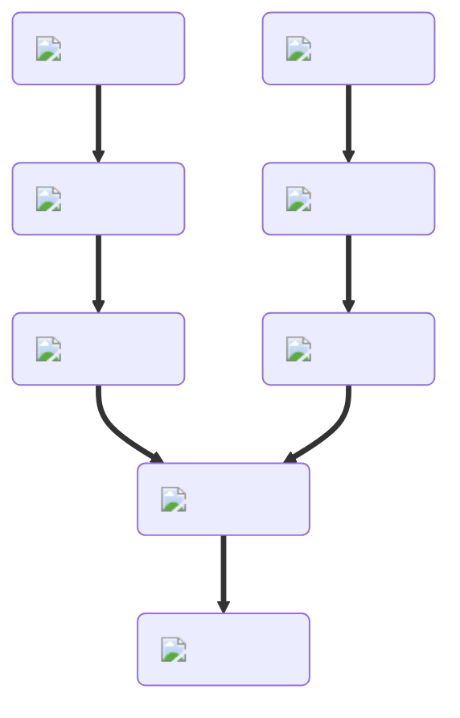

---
hide:
  - toc
---
<figure markdown="1">
# Fried Egg Sandwich
{ .item-image }

```mermaid
graph TD
    EGG(<img src="../../assets/images/cooking/egg.webp" width="50"/>)
    POT1(<img src="../../assets/images/cooking/pot.webp" width="50"/>)
    FRIEDEGG(<img src="../../assets/images/cooking/friedEgg.webp" width="50"/>)
    FLOUR(<img src="../../assets/images/cooking/flour.webp" width="50"/>)
    OVEN(<img src="../../assets/images/cooking/oven.webp" width="50"/>)
    BREAD(<img src="../../assets/images/cooking/bread.webp" width="50"/>)
    POT2(<img src="../../assets/images/cooking/pot.webp" width="50"/>)
    FRIEDEGGSANDWICH(<img src="../../assets/images/cooking/friedEggSandwich.webp" width="50"/>)

    EGG ==> POT1
    POT1 ==> FRIEDEGG
    FLOUR ==> OVEN
    OVEN ==> BREAD
    FRIEDEGG ==> POT2
    BREAD ==> POT2
    POT2 ==> FRIEDEGGSANDWICH

    click EGG "../egg"
    click POT1 "../pot"
    click FRIEDEGG "../friedEgg"
    click FLOUR "../flour"
    click OVEN "../oven"
    click BREAD "../bread"
    click POT2 "../pot"
    click FRIEDEGGSANDWICH "../friedEggSandwich"
```

</figure>