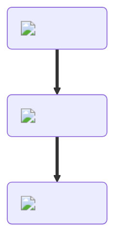

---
hide:
  - toc
description: How to make a fruit salad in yeeps hide and seek
---
<figure markdown="1">
# Fruit Salad
{ .item-image }

```mermaid
graph TD
    FRUIT(<img src="../../assets/images/cooking/fruit.webp" width="50"/>)
    POT(<img src="../../assets/images/cooking/pot.webp" width="50"/>)
    FRUITSALAD(<img src="../../assets/images/cooking/fruitSalad.webp" width="50"/>)

    FRUIT ==> POT
    POT ==> FRUITSALAD

    click FRUIT "../fruit"
    click POT "../pot"
    click FRUITSALAD "../fruitSalad"
```

</figure>