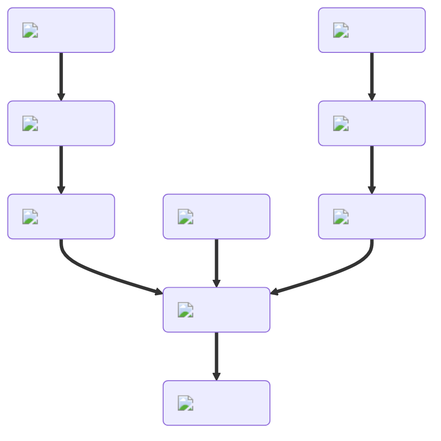

---
hide:
  - toc
---
<figure markdown="1">
# Hamburger
{ .item-image }

```mermaid
graph TD
    FLOUR(<img src="../../assets/images/cooking/flour.webp" width="50"/>)
    OVEN(<img src="../../assets/images/cooking/oven.webp" width="50"/>)
    BREAD(<img src="../../assets/images/cooking/bread.webp" width="50"/>)
    BEEF(<img src="../../assets/images/cooking/beef.webp" width="50"/>)
    POT1(<img src="../../assets/images/cooking/pot.webp" width="50"/>)
    STEAK(<img src="../../assets/images/cooking/steak.webp" width="50"/>)
    LETTUCE(<img src="../../assets/images/cooking/lettuce.webp" width="50"/>)
    POT2(<img src="../../assets/images/cooking/pot.webp" width="50"/>)
    HAMBURGER(<img src="../../assets/images/cooking/hamburger.webp" width="50"/>)

    FLOUR ==> OVEN
    OVEN ==> BREAD
    BEEF  ==> POT1
    POT1 ==> STEAK
    STEAK ==> POT2
    LETTUCE ==> POT2
    BREAD ==> POT2
    POT2 ==> HAMBURGER 

    click FLOUR "../flour"
    click OVEN "../oven"
    click BEEF "../beef"
    click POT1 "../pot"
    click STEAK "../steak"
    click LETTUCE "../lettuce"
    click BREAD "../bread"
    click POT2 "../pot"
    click HAMBURGER "../hamburger"
```

</figure>