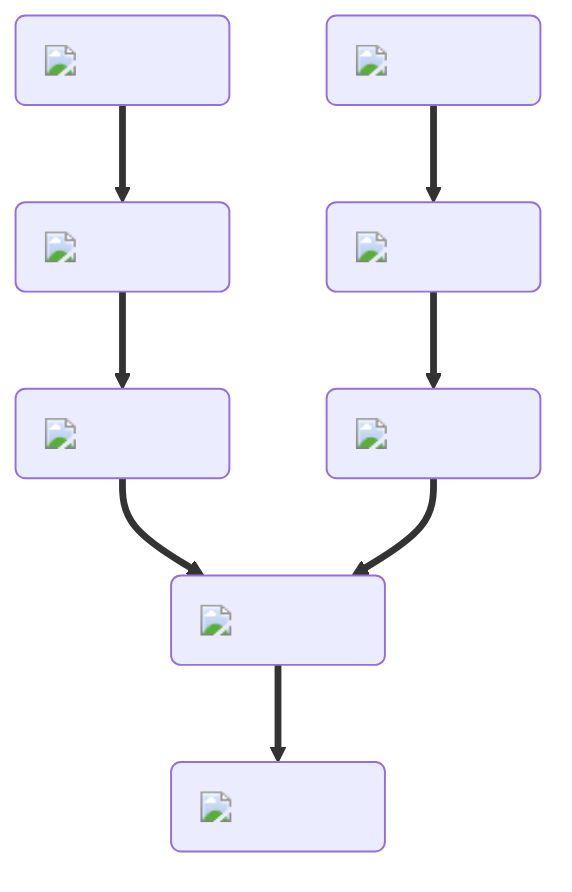

---
hide:
  - toc
---
<figure markdown="1">
# Hotdog
{ .item-image }

```mermaid
graph TD
    BACON(<img src="../../assets/images/cooking/bacon.webp" width="50"/>)
    OVEN1(<img src="../../assets/images/cooking/oven.webp" width="50"/>)
    SAUSAGE(<img src="../../assets/images/cooking/sausage.webp" width="50"/>)
    FLOUR(<img src="../../assets/images/cooking/flour.webp" width="50"/>)
    OVEN2(<img src="../../assets/images/cooking/oven.webp" width="50"/>)
    BREAD(<img src="../../assets/images/cooking/bread.webp" width="50"/>)
    POT(<img src="../../assets/images/cooking/pot.webp" width="50"/>)
    HOTDOG(<img src="../../assets/images/cooking/hotdog.webp" width="50"/>)

    BACON ==> OVEN1
    OVEN1 ==> SAUSAGE
    FLOUR ==> OVEN2
    OVEN2 ==> BREAD
    SAUSAGE ==> POT
    BREAD ==> POT
    POT ==> HOTDOG 

    click BACON "../bacon"
    click OVEN1 "../oven"
    click FLOUR "../flour"
    click OVEN2 "../oven"
    click SAUSAGE "../sausage"
    click BREAD "../bread"
    click POT "../pot"
    click HOTDOG "../hotdog"

```

</figure>