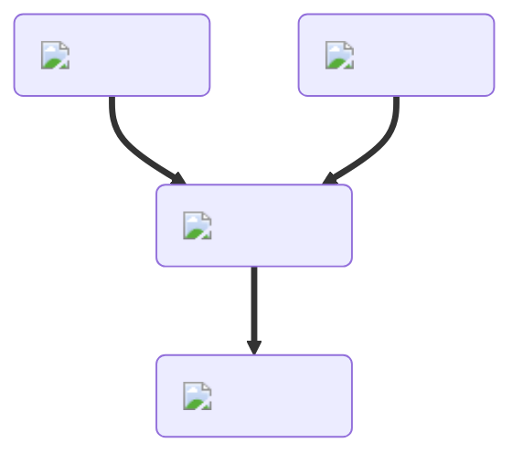

---
hide:
  - toc
---
<figure markdown="1">
# Jelly
{ .item-image }

```mermaid
graph TD
    FRUIT(<img src="../../assets/images/cooking/fruit.webp" width="50"/>)
    SUGAR(<img src="../../assets/images/cooking/sugar.webp" width="50"/>)
    OVEN(<img src="../../assets/images/cooking/oven.webp" width="50"/>)
    JELLY(<img src="../../assets/images/cooking/jelly.webp" width="50"/>)

    FRUIT ==> OVEN
    SUGAR ==> OVEN
    OVEN ==> JELLY

    click FRUIT "../fruit"
    click SUGAR "../sugar"
    click OVEN "../oven"
    click JELLY "../jelly"
```

</figure>