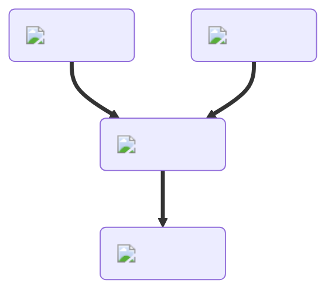

---
hide:
  - toc
description: How to make jelly in yeeps hide and seek
---
<figure markdown="1">
# Jelly
{ .item-image }

## Used to craft  

- [Crepe { width="100" }](../cooking/crepe.md)   
- [Jelly Sandwich { width="100" }](../cooking/jellySandwich.md)   

</figure>