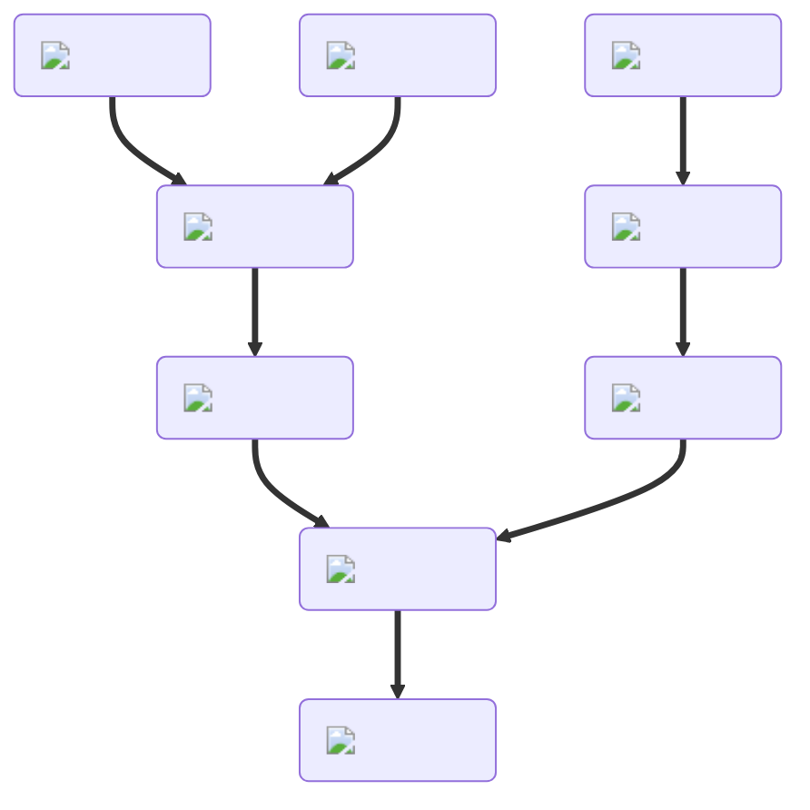

---
hide:
  - toc
description: How to make a jelly sandwich in yeeps hide and seek
---
<figure markdown="1">
# Jelly Sandwich
{ .item-image }

```mermaid
graph TD
    FRUIT(<img src="../../assets/images/cooking/fruit.webp" width="50"/>)
    SUGAR(<img src="../../assets/images/cooking/sugar.webp" width="50"/>)
    OVEN1(<img src="../../assets/images/cooking/oven.webp" width="50"/>)
    JELLY(<img src="../../assets/images/cooking/jelly.webp" width="50"/>)
    FLOUR(<img src="../../assets/images/cooking/flour.webp" width="50"/>)
    OVEN2(<img src="../../assets/images/cooking/oven.webp" width="50"/>)
    BREAD(<img src="../../assets/images/cooking/bread.webp" width="50"/>)
    POT(<img src="../../assets/images/cooking/pot.webp" width="50"/>)
    JELLYSANDWICH(<img src="../../assets/images/cooking/jellySandwich.webp" width="50"/>)

    FRUIT ==> OVEN1
    SUGAR ==> OVEN1
    OVEN1 ==> JELLY
    FLOUR ==> OVEN2
    OVEN2 ==> BREAD
    JELLY ==> POT
    BREAD ==> POT
    POT ==> JELLYSANDWICH

    click FRUIT "../fruit"
    click SUGAR "../sugar"
    click OVEN1 "../oven"
    click JELLY "../jelly"
    click FLOUR "../flour"
    click OVEN2 "../oven"
    click BREAD "../bread"
    click POT "../pot"
    click JELLYSANDWICH "../jellySandwich"
```
</figure>