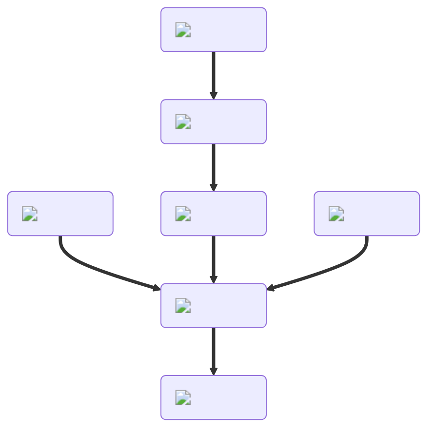

---
hide:
  - toc
description: How to make lasagna in yeeps hide and seek
---
<figure markdown="1">
# Lasagna
{ .item-image }

```mermaid
graph TD
    MILK(<img src="../../assets/images/cooking/milk.webp" width="50"/>)
    POT(<img src="../../assets/images/cooking/pot.webp" width="50"/>)
    CHEESE(<img src="../../assets/images/cooking/cheese.webp" width="50"/>)
    TOMATO(<img src="../../assets/images/cooking/tomato.webp" width="50"/>)
    NOODLES(<img src="../../assets/images/cooking/noodles.webp" width="50"/>)
    OVEN(<img src="../../assets/images/cooking/oven.webp" width="50"/>)
    LASAGNA(<img src="../../assets/images/cooking/lasagna.webp" width="50"/>)

    MILK ==> POT
    POT ==> CHEESE
    TOMATO ==> OVEN
    CHEESE ==> OVEN
    NOODLES ==> OVEN
    OVEN ==> LASAGNA

    click MILK "../milk"
    click POT "../pot"
    click TOMATO "../tomato"
    click CHEESE "../cheese"
    click NOODLES "../noodles"
    click OVEN "../oven"
    click LASAGNA "../lasagna"
```

</figure>