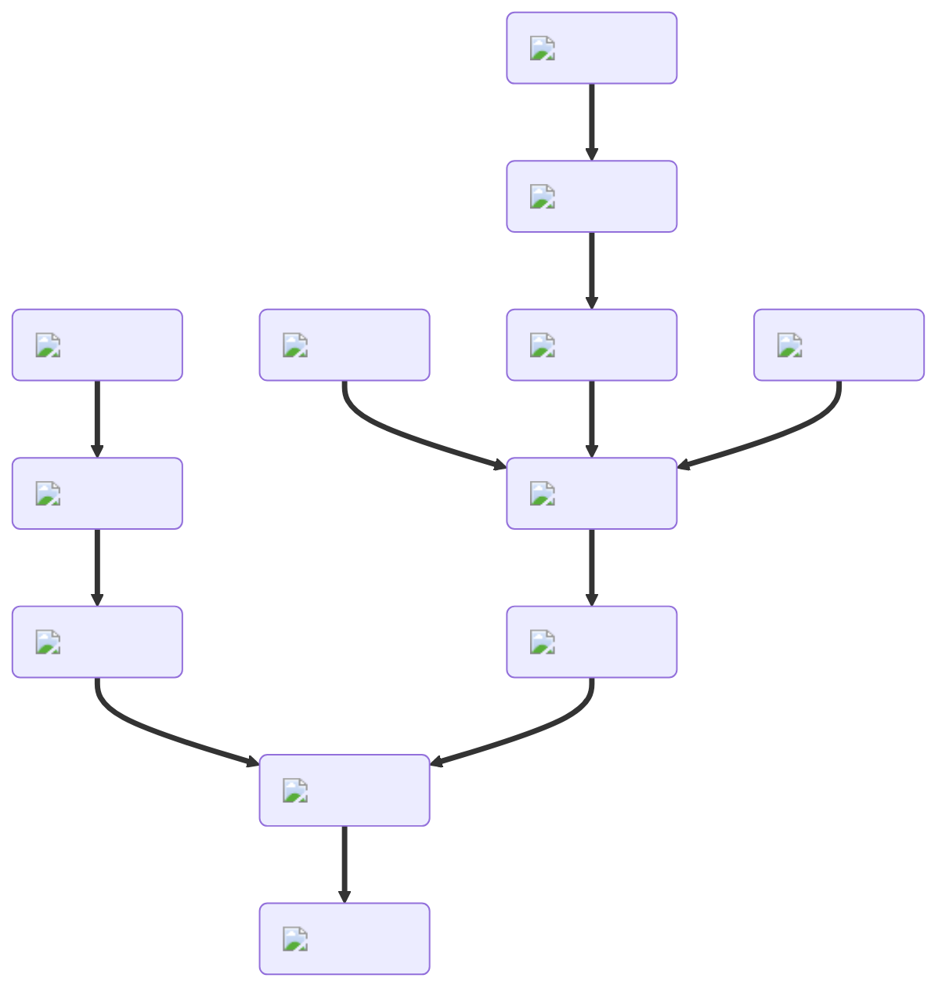

---
hide:
  - toc
---
<figure markdown="1">
# Pepperoni Pizza
{ .item-image }

```mermaid
graph TD
    MILK(<img src="../../assets/images/cooking/milk.webp" width="50"/>)
    POT(<img src="../../assets/images/cooking/pot.webp" width="50"/>)
    CHEESE(<img src="../../assets/images/cooking/cheese.webp" width="50"/>)
    FLOUR(<img src="../../assets/images/cooking/flour.webp" width="50"/>)
    TOMATO(<img src="../../assets/images/cooking/tomato.webp" width="50"/>)
    OVEN1(<img src="../../assets/images/cooking/oven.webp" width="50"/>)
    PIZZA(<img src="../../assets/images/cooking/pizza.webp" width="50"/>)
    BACON(<img src="../../assets/images/cooking/bacon.webp" width="50"/>)
    OVEN2(<img src="../../assets/images/cooking/oven.webp" width="50"/>)
    SAUSAGE(<img src="../../assets/images/cooking/sausage.webp" width="50"/>)
    OVEN3(<img src="../../assets/images/cooking/oven.webp" width="50"/>)
    PEPPERONIPIZZA(<img src="../../assets/images/cooking/pepperoniPizza.webp" width="50"/>)

    MILK ==> POT
    POT ==> CHEESE
    FLOUR ==> OVEN1
    CHEESE ==> OVEN1
    TOMATO ==> OVEN1
    OVEN1 ==> PIZZA
    BACON ==> OVEN2
    OVEN2 ==> SAUSAGE
    SAUSAGE ==> OVEN3
    PIZZA ==> OVEN3
    OVEN3 ==> PEPPERONIPIZZA

    click MILK "../milk"
    click POT "../pot"
    click CHEESE "../cheese"
    click FLOUR "../flour"
    click TOMATO "../tomato"
    click OVEN1 "../oven"
    click BACON "../bacon"
    click OVEN2 "../oven"
    click SAUSAGE "../sausage"
    click PIZZA "../pizza"
    click OVEN3 "../oven"
    click PEPPERONIPIZZA "../pepperoniPizza"
```

</figure>