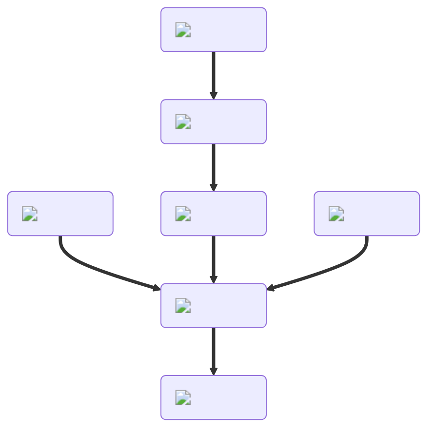

---
hide:
  - toc
description: How to make a pizza in yeeps hide and seek
---
<figure markdown="1">
# Pizza
{ .item-image }

## Used to craft

- [Hawaiian Pizza { width="100" }](../cooking/hawaiianPizza.md)
- [Pepperoni Pizza { width="100" }](../cooking/pepperoniPizza.md)
- [Pizza Bagel { width="100" }](../cooking/pizzaBagel.md)

</figure>