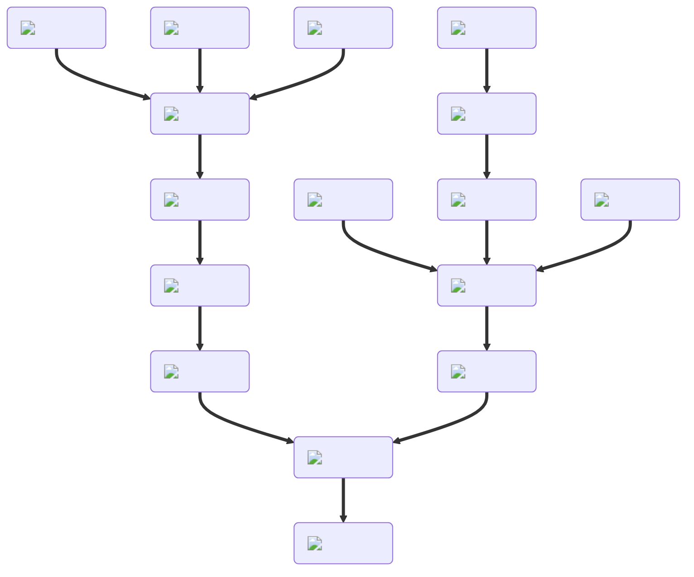

---
hide:
  - toc
description: How to make a pizza bagel in yeeps hide and seek
---
<figure markdown="1">
# Pizza Bagel
{ .item-image }

```mermaid
graph TD
    MILK1(<img src="../../assets/images/cooking/milk.webp" width="50"/>)
    POT1(<img src="../../assets/images/cooking/pot.webp" width="50"/>)
    CHEESE(<img src="../../assets/images/cooking/cheese.webp" width="50"/>)
    FLOUR1(<img src="../../assets/images/cooking/flour.webp" width="50"/>)
    TOMATO(<img src="../../assets/images/cooking/tomato.webp" width="50"/>)
    OVEN1(<img src="../../assets/images/cooking/oven.webp" width="50"/>)
    PIZZA(<img src="../../assets/images/cooking/pizza.webp" width="50"/>)
    FLOUR2(<img src="../../assets/images/cooking/flour.webp" width="50"/>)
    MILK2(<img src="../../assets/images/cooking/milk.webp" width="50"/>)
    EGGS(<img src="../../assets/images/cooking/egg.webp" width="50"/>)
    POT2(<img src="../../assets/images/cooking/pot.webp" width="50"/>)
    BATTER(<img src="../../assets/images/cooking/batter.webp" width="50"/>)
    OVEN2(<img src="../../assets/images/cooking/oven.webp" width="50"/>)
    BAGEL(<img src="../../assets/images/cooking/bagel.webp" width="50"/>)
    OVEN3(<img src="../../assets/images/cooking/oven.webp" width="50"/>)
    PIZZABAGEL(<img src="../../assets/images/cooking/pizzaBagel.webp" width="50"/>)

    MILK1 ==> POT1
    POT1 ==> CHEESE
    FLOUR1 ==> OVEN1
    CHEESE ==> OVEN1
    TOMATO ==> OVEN1
    OVEN1 ==> PIZZA
    FLOUR2 ==> POT2
    MILK2 ==> POT2
    EGGS ==> POT2
    POT2 ==> BATTER
    BATTER ==> OVEN2
    OVEN2 ==> BAGEL
    BAGEL ==> OVEN3
    PIZZA ==> OVEN3
    OVEN3 ==> PIZZABAGEL

    click MILK1 "../MILK1"
    click POT1 "../POT1"
    click CHEESE "../cheese"
    click FLOUR1 "../FLOUR1"
    click TOMATO "../tomato"
    click OVEN1 "../OVEN1"
    click PIZZA "../pizza"
    click FLOUR2 "../flour"
    click EGGS "../egg"
    click MILK2 "../milk"
    click POT2 "../pot"
    click BATTER "../batter"
    click OVEN2 "../oven"
    click BAGEL "../bagel"
    click OVEN3 "../oven"
    click PIZZABAGEL "../pizzaBagel"

```

</figure>
