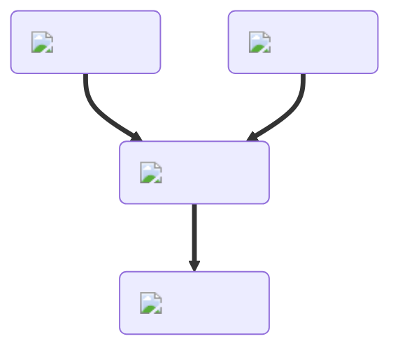

---
hide:
  - toc
description: How to make ramen in yeeps hide and seek
---
<figure markdown="1">
# Ramen
{ .item-image }

```mermaid
graph TD
    NOODLES(<img src="../../assets/images/cooking/noodles.webp" width="50"/>)
    EGGS(<img src="../../assets/images/cooking/egg.webp" width="50"/>)
    POT(<img src="../../assets/images/cooking/pot.webp" width="50"/>)
    RAMEN(<img src="../../assets/images/cooking/ramen.webp" width="50"/>)

    NOODLES ==> POT
    EGGS ==> POT
    POT ==> RAMEN

    click NOODLES "../noodles"
    click EGGS "../egg"
    click POT "../pot"
    click RAMEN "../ramen"
```

</figure>