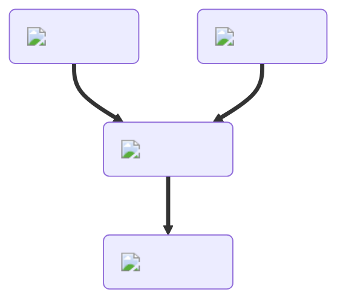

---
hide:
  - toc
description: How to make a salad in yeeps hide and seek
---
<figure markdown="1">
# Salad
{ .item-image }

```mermaid
graph TD
    TOMATO(<img src="../../assets/images/cooking/tomato.webp" width="50"/>)
    LETTUCE(<img src="../../assets/images/cooking/lettuce.webp" width="50"/>)
    POT(<img src="../../assets/images/cooking/pot.webp" width="50"/>)
    SALAD(<img src="../../assets/images/cooking/salad.webp" width="50"/>)

    TOMATO ==> POT
    LETTUCE ==> POT
    POT ==> SALAD 
    
    click TOMATO "../tomato"
    click LETTUCE "../lettuce"
    click POT "../pot"
    click SALAD "../salad"
```

## Used to craft

- [BLT { width="100" }](../cooking/blt.md)

</figure>