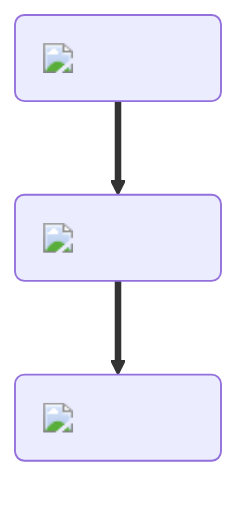

---
hide:
  - toc
---
<figure markdown="1">
# Sausage
{ .item-image }

```mermaid
graph TD
    BACON(<img src="../../assets/images/cooking/bacon.webp" width="50"/>)
    OVEN(<img src="../../assets/images/cooking/oven.webp" width="50"/>)
    SAUSAGE(<img src="../../assets/images/cooking/sausage.webp" width="50"/>)

    BACON ==> OVEN
    OVEN ==> SAUSAGE

    click BACON "../bacon"
    click OVEN "../oven"
    click SAUSAGE "../sausage"
```

</figure>