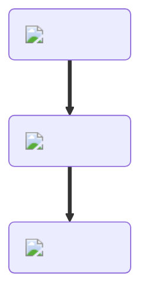

---
hide:
  - toc
description: How to make a steak in yeeps hide and seek
---
<figure markdown="1">
# Steak
{ .item-image }

## Used to craft

- [Beef Stew { width="100" }](../cooking/beefStew.md)
- [Cheeseburger { width="100" }](../cooking/cheeseburger.md)
- [Hamburger { width="100" }](../cooking/hamburger.md)
- [Steak Sub { width="100" }](../cooking/steakSub.md)
- [Stir Fry { width="100" }](../cooking/stirFry.md)

</figure>